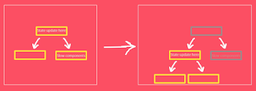
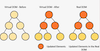

[back](../../README.md)

#### Foundation

[Branch](https://github.com/nygilgp/learn-patterns-designs-multi/tree/basics)

Components can encapsulate small things or large things. The whole application is a component and every single thing that comes are components.

##### JSX

Write JS similar to HTML.

When JSX executes, it get converted to JS

    <h1 id="hello">Hi there...</h1>; to React.createElement('h1', { id: 'hello' }, 'hi there...')

createElement is very ugly to write and read, so JSX.

Things to note while writing JSX

    tab-index => tabIndex

So remove the - and use camelcase.

But we don't do this for custom data or aria-label will not change in JSX.

    data-id="34" aria-label="Enter name here"

Some keywords can't be used

    calss to className="container"
    for to htmlFor="id"

Style need to be passed as object

    style={{ backgroundColor: "red" }}

here you can see the css property also background-color needs to be backgroundColor

Now any time you see {} in JSX, it will execute JS inside it.

    <label>{2 + 2}<label> output as 4

You need to close of your JSX tag (self close or closing tag at the end of it)

    <input /> or <input></input>

undefined, null and false will return nothing from the component.

JSX when ever it sees a element which starts with lower case letter cosiders it as normal HTML tag(Todolist => todolist)

##### useState

When we need mutable data inside a component we use state.

When ever the state change the whole component and its children are rerendered.

If we pass a function inside useState to get initial value, then it will be only executed once.

    const [name, setName] = useState(() => {
        // A slow code
        console.log('I execute only once')
        return "Joe"
    })

is better than

    function slowFunc() {
        console.log("Called always when a state is set.")
        return "Joe"
    }
    const [name, setName] = useState(slowFunc())

Another solution of the above is to pass by value as below, this will be called only once

    const [name, setName] = useState(slowFunc);

If you care about the previous value of the state, then we need to use the.

##### VDOM

Virtual DOM is a light version of the actual DOM. It is created by ReactJS and kept in the memory. When ever a state change in the component, the component along with all its children are re-rendered. This is going to be a very difficult and slow if we update every thing in the actual DOM. So what ReactJS does is it runs diffing algorithum and only the difference between previous VDOM and new VDOM is found out. Only that changed element is updated in the actual DOM.

Now for a component to rerender it is necessary to change its state or its parents state.

###### useEffect

Used for dealing with side effects inside components.

useEffect called every time, if we don't pass any dependency array.

    useEffect(() => {
        console.log('Allways executed when the component rerenders.')
    })

useEffect called only once on the mount of component, if we pass an empty dependency array.

    useEffect(() => {
        console.log('Executed only once when the component mount.')
    }, [])

useEffect called every time when the values in the dependency array changes.

    useEffect(() => {
        console.log('Executed only when value changes.')
    }, [name])

useEffect can return a cleanup function as the return, which will be executed before next execution or before unmounting of the component.
Common use case is to cean up added event handlers or setTimout handlers, so they don't execute indefinitly.

    useEffect(() => {
        const handler = () => {
            console.log('handler called')
        };
        document.addEventListner("click", handler);

        return () => {
            document.removeEventListener("click", handler);
        }
    }, [name])

###### reference vs value issue in useEffect

If we define an object const and use it as a dependant value, then useEffect will always get updated and even if the value is the same the reference won't be the same.

    const [name, setName] = useState();
    const [age, setAge] = useState();
    const person = {name}

    useEffect(() => {
        console.log('Executed allways even when person is not updated')
    }, [person])

    // This is because, the person object is created every time the compnent renders causing the effect to be executed every time. Even if the name doesn't change, on age change also the effect will be acted on.

##### Wasted Re-render

When a state update happen, all the children component and sub children are re-rendered. So if possible move the sate change that doesn't affect the other component should be moved under a component that is only affected by that state.

This is the same with custom hook as well, only use the states that are needed in that component, else seperate it out.

Passing child components as prop or children prop when the code is complex is the best way to avoid re-rendering. So the state change in the parent component will rendrer the direct child in the parent component and avoid rendering the components passed as props or children prop.

    <DynamicScroll
      content={
        <>
          <SlowComponent />
          <BlaBla />
          <AdditionalComplexThings />
        </>
      }
    />

    -- or as children --

    <DynamicScroll>
      <SlowComponent />
      <BlaBla />
      <AdditionalComplexThings />
    </DynamicScroll>

    const DynamicScroll = ({ content }: { content: ReactNode }) => {
    .
    .
    .

    return (
        <ScrollableContainer onScroll={handleScroll}>
            <DynamicBlock top={position === 113 ? 113 : position} color={blockColor}>
            🛒
            </DynamicBlock>
            {content}
        </ScrollableContainer>
    );

###### Using default props in elements

    export default function App() {
        return (
            <>
            <Button type="primary" icon={<Loading color="white" />} />
            <Button type="secondary" icon={<Loading />} />
            <Button icon={<Loading />} />
            </>
        );
    }

    const Button = ({
        type,
        icon,
        size,
        }: {
        type?: string;
        icon: ReactElement;
        size?: string;
    }) => {
        const defaultProps = {
            size: size === "lg" ? "lg" : "md",
            color: type === "primary" ? "white" : "black",
        };

        const newProps = {
            ...defaultProps,
            ...icon.props,
        };

        const clonedIcon = React.cloneElement(icon, newProps);

        return <button>Submit {clonedIcon}</button>;
    };

[back](../../README.md)
